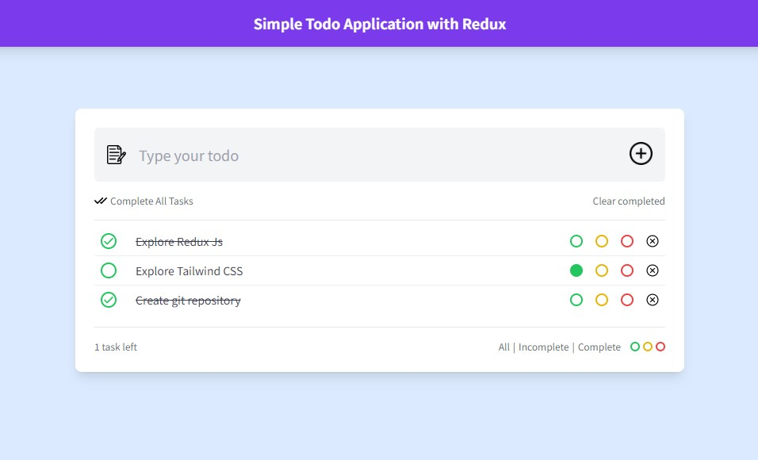

# Todo App

A simple and efficient todo application built with React and Redux.



## Features

- Add, edit, and delete tasks
- Mark tasks as completed
- Filter tasks (base on status(completed,incompleted,and All) and colors)

## Getting Started

Follow these instructions to get a copy of the project up and running on your local machine for development and testing purposes.

### Prerequisites

- Node.js
- npm (Node Package Manager)

### Installation

1. Clone the repository:
    ```sh
    git clone https://github.com/Palashtalukder78/simple-functional-todo-application-with-redux.git
    cd simple-functional-todo-application-with-redux
    ```

2. Install dependencies:
    ```sh
    npm install
    ```

3. Start the development server:
    ```sh
    npm run dev
    ```

The app should now be running on `http://localhost:5173/`.

## Usage

1. **Add a new task:** Enter a task in the input field and press Enter or click the 'Add' symbol.
3. **Delete a task:** Click the 'Delete' button next to a task to remove it.
4. **Mark a task as completed:** Click the checkbox next to a task.
5. **Filter tasks:** Use the filter buttons and colors to view all tasks